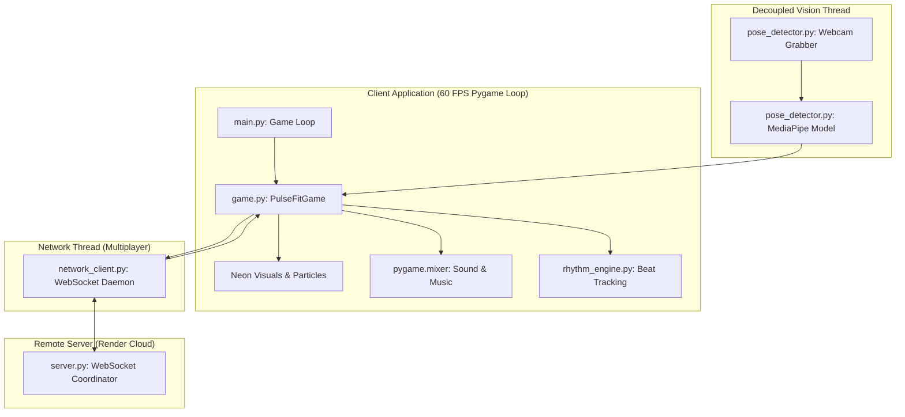

# PulseFit Arena - AI Cyber Rhythm Fitness

PulseFit Arena is a rhythm fitness desktop game. Players perform physical squats in sync with electronic tracks using real-time computer vision pose tracking from a webcam.

The game features cyberpunk visuals, a custom procedural audio synthesizer, particle effects, real-time posture coaching, and multiplayer modes (both local split-screen and real-time online lobbies).

---

## Game Modes: Local Play and Online Compete

PulseFit Arena supports both local play and live online competition:

* **Offline Solo Workouts**: Calibrate your webcam, squat on the beat, and maintain correct form to earn points and combo multipliers.
* **Local Splitscreen Co-Op**: Play with a friend using a single webcam. The game splits the webcam feed into Left (Player 1) and Right (Player 2) zones for dual skeletal tracking.
* **Online Arena (Room Codes)**: Join or host room lobbies using a 4-letter Room Code. Connect with other players over our live production server. Player skeletons are streamed asynchronously at 30 Hz and drawn on screen in real-time.
* **Keyboard Simulation Mode**: If no webcam is connected, the game switches to keyboard input so you can still play:
    * **Player 1**: Press SPACEBAR on the beat.
    * **Player 2**: Press ENTER on the beat.

---

## Core Features

1. **Dual-Threaded Camera Pipeline**: The webcam frame grabber runs in a background thread to prevent latency. The MediaPipe computer vision inference runs in a separate thread, sending only the newest frame to the UI. This keeps the game UI running at 60 FPS.
2. **Webcam Calibration Guide**: A visual silhouette guide helps players align their body (shoulders, hips, knees, and ankles) in frame before the countdown starts.
3. **Out-of-Frame Auto-Pause**: If a player steps out of the webcam frame during a song, the music and notes pause automatically. Gameplay resumes when the player steps back into position.
4. **Biomechanical Posture Coaching**: Calculates knee angle depth and spine tilt. Tells players to straighten their back if they lean too far forward, and rewards deep squats.
5. **Procedural Audio Synthesizer**: Synthesizes wave audio tracks and caches beat timestamps in JSON files on startup.

---

## System Architecture

PulseFit Arena splits the graphics, vision processing, and network communications into separate threads for performance.



---

## Windows Standalone Executable (No Python Required)

For players who want to run the game directly:
1. Download the single-file executable: **[Download PulseFitArena.exe](https://github.com/KaranKumar2326/PulseFit/releases/download/v1.0.0/PulseFitArena.exe)** (about 115 MB).
2. Double-click the downloaded `PulseFitArena.exe` file to start playing!
3. The executable is self-contained with all assets (audio files, sound effects, and pose models) and connects to the live online lobby.

---

## Developer Setup and Run Instructions

To run the source code locally, you need Python 3.8 or newer installed.

### 1. Install Dependencies
```bash
pip install -r requirements_client.txt
```

### 2. Generate Audio Assets
Generate the sound effects and techno tracks:
```bash
python utils.py
```

### 3. Launch the Game
```bash
python main.py
```

---

## Running Your Own Multiplayer Server

If you want to host your own lobby server:
1. Run the server coordinator script:
    ```bash
    python server.py
    ```
2. Update the WebSocket URL inside your client code to point to your local IP or host.
